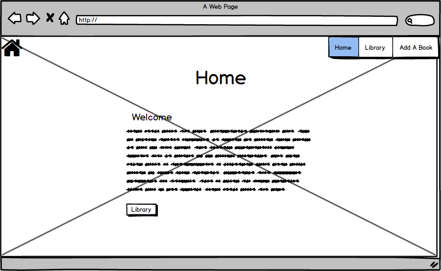
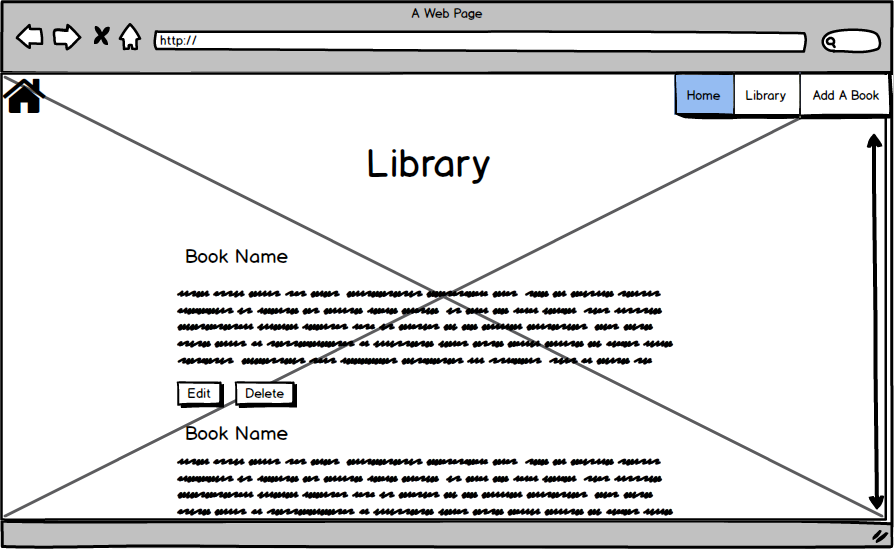
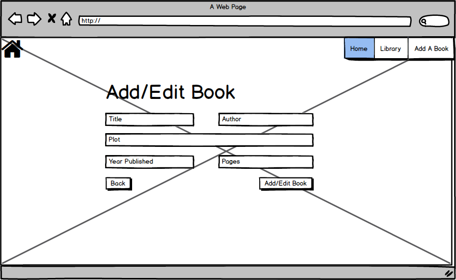

# Community Books

<h2>https://ms3-community-books.herokuapp.com//</h2>

Welcome to the site and I hope you enjoy it. This site is used as a library for recommending books and looking for books to read that have been recommended by other users.
 
## UX
 
I created this project as a place for people to share book recommendations between each other. Giving users full access to add, edit and delete entries as they see fit.

<h2>Wireframes</h2>

All wireframes were made using Balsamiq.

<h3>index.html</h3>

    

<h3>map.html</h3>

    

<h3>contact.html</h3>

    

<h2>User Stories</h2>

- I want to view books added by other users.
  
- I want the option to edit a book if the information I see is incorrect.

- I want to remove a book if I don't think it should be on the site.

- I want to add a book that I like.

<h2>Features</h2>

<h3>app.py</h3>

In my app I use routes and view to direct to app pages and functions on the site.

<h3>index.html</h3>
- On this page I just made a card detailing the idea behind the site and some simple instructions.

<h3>library.html</h3>
- I used this page to loop throught all books from MongoDB and display them nicely in their own card accompanied by "Edit" and "Delete" buttons.

<h3>addbook.html</h3>
- I used form elements on this page to accept user input and upload it to MongoDB. Once done, the user is redirected to the Library page where they can see their entries.
I also gave a button to return to the Library should the user wish to go back without making an addition.

<h3>editbook.html</h3>
- I used form elements on this page to accept user input for an existing entry and update the relevant book on MongoDB. The user is then redirected to the Library where they
can view their entry. As in the "addbook.html" section there is again a button allowing users to return to the library without making changes.

<h3>base.html</h3>
- This page contains the pages nav element and extends it to all other pages. I also added all my links for CSS, JS, JQuery and Materialize here.
 
<h2>Existing Features</h2>
- Across the site I have implimented all CRUD features.

- I have also added a scroll to top button using JS and JQuery so that users can jump to the top of the page if they have scrolled far down.

- I have included a .gitignore file to conceal my environment variables in env.py and in __pycache__/.

### Features Left to Implement
- In future development I would like to include more form validations.

- I would like to include alert buttons on the "Edit" and "Delete" pages to confirm the users input before the either commit changes or remove an entry.

## Technologies Used

- [JQuery](https://jquery.com)
    - The project uses **JQuery** to support some design and funtionality.

- [Materialize](https://materializecss.com/)
    - The project uses **Materialize** to simplify the design process.
    
- [Flask](https://flask.palletsprojects.com/en/1.1.x/)
    - FLask was used to create my application.

## Testing

1. index.html
    - I tested all buttons to make sure everything is linked correctly.

2. library.html
    - I again tested all buttons to make sure everything is linked correctly. 
    - I clicked on the delete button. I then made sure the entry was no longer on my MongoDB cluster or the library page.

3. addbook.html
    - I again tested all buttons to make sure everything is linked correctly. 
    - I added entries to all fields and then clicked the "Add Book" button. I then made sure the book was added to both the Library page and my MongoDB cluster.

4. editbook.html
    - I again tested all buttons to make sure everything is linked correctly. 
    - I edited an existing entry on all fields. I then made sure the entry had changed both on the Library page and in my MongoDB cluster.

## Deployment

I used Heroku to deploy my site.

This site can also be deployed by selecting the 'Clone' option from the below GitHub repository.

https://github.com/DalyAD/CommunityBooks

### Content
- The design elements were used from the Materialize site.
- I customised a scroll to top button that I got from W3schools from the followint link (https://www.w3schools.com/howto/howto_js_scroll_to_top.asp)

### Media
- The background image I used was found using Google images.
